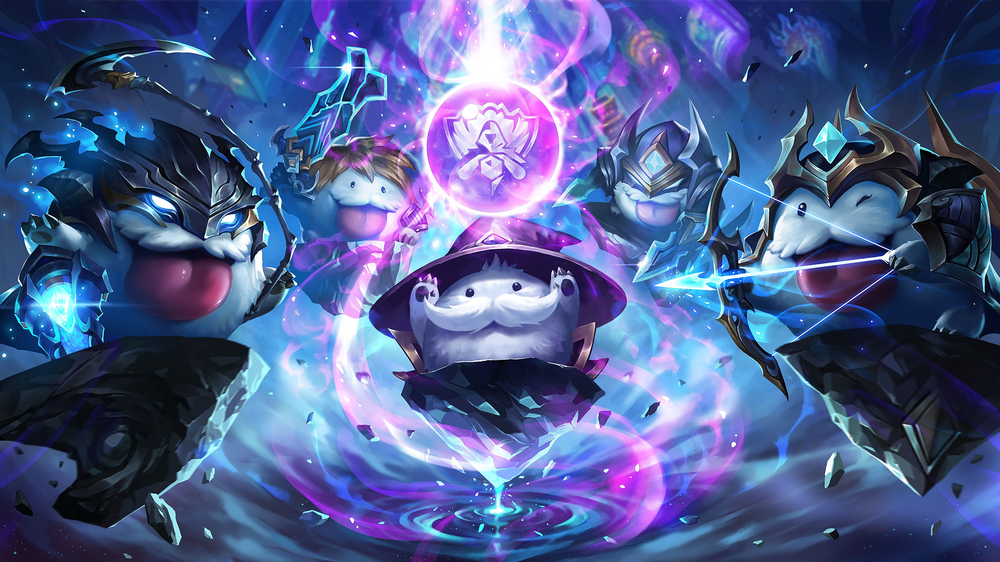
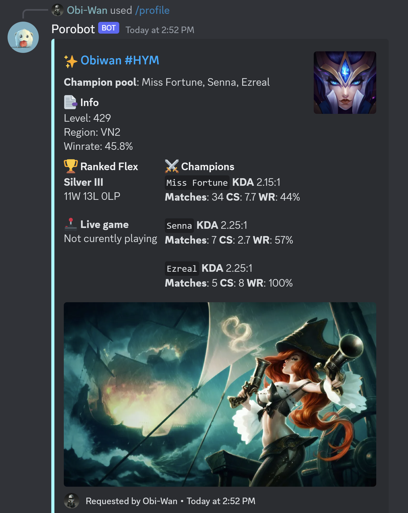

# Porobot - League of Legends Discord Bot 


**Update** (12 July 2023): Invite Porobot to your discord server at [Porobot](https://nauqh.github.io/Porodocs/)

## About the project



Porobot is a compact system for gathering and organizing game statistics data from [Riot API](https://developer.riotgames.com/).

In short, it allows you to:

* Retrieve player statistics such as match history, ranked information, or even custom data of your choice.
* Store the data in a scalable database using technologies like [PostgreSQL](https://www.postgresql.org/) and [SQLAlchemy](https://www.sqlalchemy.org/).
* Utilize various tools to model and analyze the behavioral data.
* Generate reports and deploy an online dashboard for convenient management.


## Features
<div style="display: flex;">
  
  
</div>

## Porobot Techstack 101
The repository structure follows the conceptual architecture of Porobot, which consists of four loosely-coupled sub-systems.

To briefly explain these four sub-systems:

* **[Extractor][extractor]** employs `Pydantic` to validate the integrity and quality of the extracted Riot data through customizable data quality checks and adherence to expected schema and format.
* **[Storage][storage]** relies on `SQLite` as a robust and feature-rich database system for persistent storage of Riot and Discord data, while leveraging `SQLAlchemy` as the ORM tool for simplified interaction with the database.
* **[Analytics][analytics]** employs `Plotly` for creating interactive and visually appealing data visualizations, `Pandas` for data transformation and analysis, and `Discord` for deploying intuitive and user-friendly dashboards to explore and analyze Riot data.
* **[Application][app]** utilizes `Hikari` as the library for building a Discord bot, providing a powerful and efficient framework for interacting with the `Discord API` and creating engaging and interactive experiences for users.

## Instalation

Local hosting of Porobot is also possible

Create a `.env` file to store the application authentication token and guild ids

```sh
BOT_TOKEN = BOT_TOKEN
GUILD = DISCORD_SERVER_ID
STDOUT_CHANNEL_ID = OUTPUT_CHANEL_ID
VOICE_CHANNEL_ID = VOICE_CHANNEL_ID
RIOT_TOKEN = RIOT_TOKEN
```

Install dependencies:

```sh
$ pip install -r requirements.txt
```

Start the bot

```sh
$ python -m bot
```

## Documentation

Since Porobot is built on the basis of `Hikari` library, it is essential to look for the library documentation for further implementation. 

- `RiotAPI`: https://developer.riotgames.com/
- `Hikari`: https://www.hikari-py.dev/
- `Lightbulb`: https://hikari-lightbulb.readthedocs.io/en/latest/

## Contributors

- [x] Nauqh - [@nauqh](https://github.com/nauqh) 
- [x] Tuanardo - [@anhtuan18602](https://github.com/anhtuan18602) 


[orchestrator]: https://www.prefect.io/
[extractor]: https://developer.spotify.com/documentation/web-api
[storage]: https://www.postgresql.org/
[analytics]: https://resonance.streamlit.app/
[app]: https://www.hikari-py.dev/